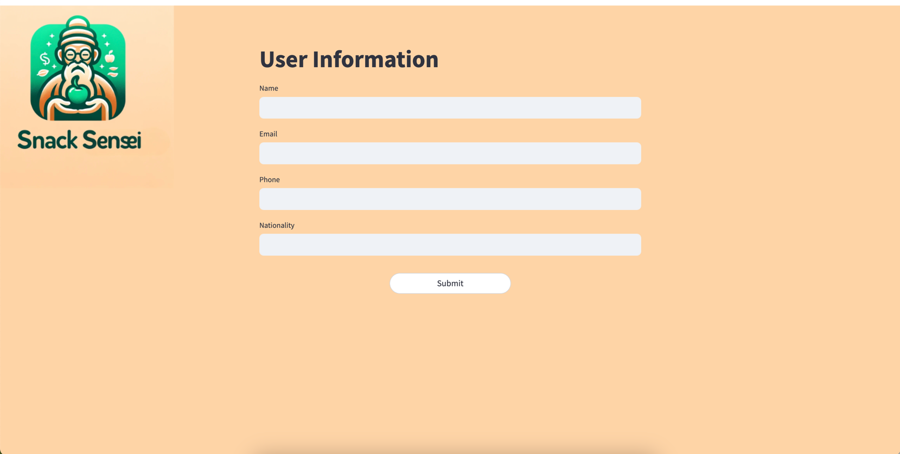

# SnackSensei

Personalize your diet plan with SnackSensei.
This project was developed in one day for the Mistral Hackathon in Paris, which took place on May 25th and 26th, 2024.

## Setup Instructions

### Step 1: Install Dependencies
First, install the required dependencies listed in the `requirements.txt` file:


```bash
pip install -r requirements.txt
```

### Step 2: Start the Database Service
Navigate to the `db` folder and start the database service:
```bash
cd db
python grocery+app.py
```

### Step 3: Run the Streamlit App
Run the Streamlit app from the root directory:
```bash
streamlit run frontend.py
```


**Note:** Please click the button twice when prompted.

Enjoy personalizing your diet plan with SnackSensei!
```
